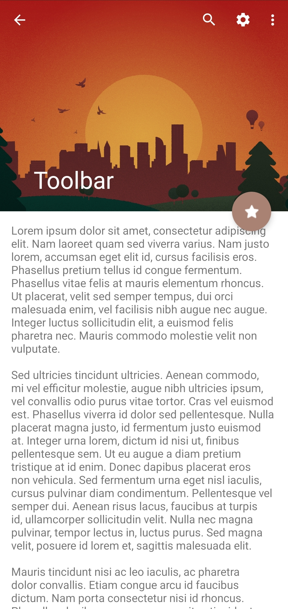
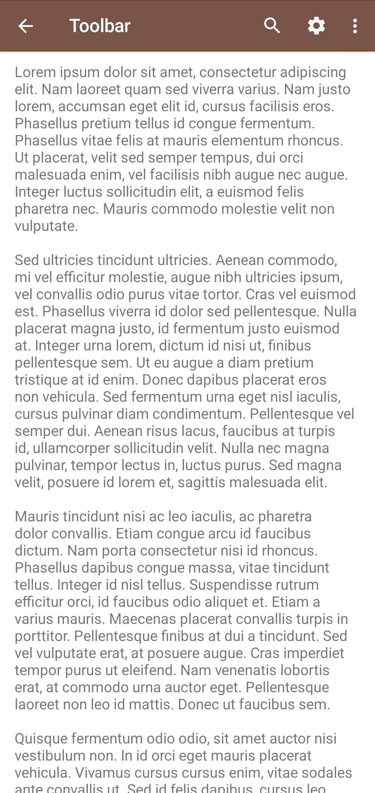

# Collapsing Toolbar Example

The application shows an example of how the Collapsing Toolbar works, as well as inflating the menu into the Actionbar. Expandable SearchView with on query listener responds to requests and shows content based on search query.

## About

### Functionality
- Collapsing Toolbar
- Search View on query listener

### UI
- [Material 2](https://material.io/develop/android)